# 🏗️ Project Evolution — Chronological Stack Build-up

> **Projeto:** IPT Cloud Course — Arquitetura Separada de Base de Dados  
> **Data:** 2026-06-23

---

## 📖 Índice Cronológico

| # | Etapa | Pasta | Descrição |
|---|-------|-------|-----------|
| 1 | **Stack Inicial** | [`01_initial_stack/`](01_initial_stack/README.md) | 7 VMs provisionadas, load tests, baseline performance |
| 2 | **Failover & Eleição** | [`02_failover_election/`](02_failover_election/README.md) | Patroni + Consul HA — kill do primary, failover automático |
| 3 | **PgBouncer Pooler** | [`03_pgbouncer/`](03_pgbouncer/README.md) | Connection pooling — 500 req/s com 50 conexões DB |
| 4 | **Redis Sentinel** | [`04_redis_sentinel/`](04_redis_sentinel/README.md) | Redis HA — 3 nós, failover automático de sessões |
| 5 | **WebSocket HA** | [`05_websocket/`](05_websocket/README.md) | RatchetPHP + Redis pub/sub — mensagens cross-instance |
| 6 | **MinIO** | [`06_minio/`](06_minio/README.md) | Object storage dedicado — separado do Redis |
| 7 | **Netdata** | [`07_netdata/`](07_netdata/README.md) | Monitorização em tempo real — dashboard GUI unificada |
| 8 | **Loki + Grafana** | [`08_loki_grafana/`](08_loki_grafana/README.md) | Logging centralizado — Promtail agents → Loki → Grafana Explore |

---

## 🎯 Linha Cronológica

```mermaid
timeline
    title Stack Build-up
    section 01 — Stack Inicial
        VMs provisioned : 7 VMs (lb1/lb2, web1/web2, db1/db2, storage1)
        Ansible run : Nginx, Apache, PHP, PostgreSQL, Patroni, Consul, HAProxy, Redis, MinIO
        Load tests : 50/s, 200/s, 500/s — zero failures
    section 02 — Failover
        Patroni debug : Fixed typo, port conflict with system PostgreSQL
        Failover test : Kill db1 master mid-attack → db2 promoted in ~4s
        Recovery test : db1 brought back → auto-rejoined as replica
    section 03 — PgBouncer
        PgBouncer installed : Co-located on db1/db2 behind HAProxy
        Pool config : 500 max clients → 50-75 PostgreSQL connections
        Performance verified : 500 req/s, 2.03ms, 99.68% under 5ms
    section 04 — Redis Sentinel
        New VMs : storage2 (192.168.44.42), storage3 (192.168.44.43)
        3-node cluster : 1 master + 2 replicas, 3 Sentinels, quorum=2
        Failover test : Kill master → Sentinel promotes replica in ~5s
        Recovery : Old master returns → Sentinel auto-demotes to replica
    section 05 — WebSocket
        RatchetPHP deployed : Co-located on web1/web2, systemd service
        Redis pub/sub : Cross-instance messages sync via Redis channel
        Nginx proxy : ip_hash sticky sessions, /ws/ → Ratchet :8000
        Client reconnect : Exponential backoff, session-aware
    section 06 — MinIO
        New VM : minio1 (192.168.44.51) dedicated
        Separation : MinIO moved out of Redis cluster VM
        s3fs mount : web1/web2 mount gallery/ via s3fs FUSE
    section 07 — Netdata
        New VM : monitor1 (192.168.44.61) Netdata Parent
        Agents : Netdata installed on all 10 existing VMs
        Streaming : All agents stream metrics → monitor1:19999
        Dashboard : Nginx proxies /netdata/ → monitor1 via VIP
    section 08 — Loki + Grafana
        Loki installed : Log aggregator on monitor1 :3100, 7-day retention
        Grafana installed : Dashboard on monitor1 :3000, Loki datasource
        Promtail agents : Log shippers on all 11 VMs, per-tier log paths
        Labels : host + tier + job for per-VM log filtering
        Dashboard : Nginx proxies /grafana/ → monitor1 via VIP
```



---

## 📊 Evolução da Performance

| Etapa | Rate | Sucesso | Latência Média | p99 | Conexões DB |
|-------|------|---------|---------------|-----|-------------|
| Stack Inicial | 500/s | 100% | 2.03ms | 4.99ms | ~500 |
| Após Failover | 500/s | 100% | 2.03ms | 4.99ms | ~500 |
| **Com PgBouncer** | **500/s** | **100%** | **2.03ms** | **3.61ms** | **50-75** ✨ |
| **Redis Sentinel** | **100/s** | **100%** | **2.11ms** | **2.79ms** | **50-75** |
| **Netdata Monitor** | — | ✅ | — | — | **50-75** |
| **Loki + Grafana** | — | ✅ | — | — | **50-75** |

---

## 🗂️ Estrutura de Ficheiros

```
diagrams/
├── README.md                              ← Este ficheiro
├── 01_initial_stack/
│   ├── README.md                          ← Load tests & baseline
│   ├── 01_architecture.mermaid            ← Stack inicial completa
│   └── 02_load_test_flow.mermaid          ← Fluxo vegeta
├── 02_failover_election/
│   ├── README.md                          ← Mecanismo de eleição
│   ├── 01_election_normal.mermaid         ← Estado normal
│   ├── 02_election_failover.mermaid       ← Primary morre
│   └── 03_election_recovery.mermaid       ← Primary volta
├── 03_pgbouncer/
│   ├── README.md                          ← Config & resultados
│   ├── 01_architecture_pgbouncer.mermaid  ← Stack com PgBouncer
│   └── 02_pgbouncer_connection_flow.mermaid ← Fluxo de pooling
├── 04_redis_sentinel/
│   ├── README.md                          ← Redis HA & failover
│   ├── 01_architecture_sentinel.mermaid   ← Stack com Redis Sentinel
│   ├── 02_failover.mermaid               ← Sentinel failover
│   └── 03_recovery.mermaid               ← Split-brain recovery
├── 05_websocket/
│   ├── README.md                          ← WebSocket HA & pub/sub
│   ├── 01_architecture_websocket.mermaid  ← Stack com WebSocket HA
│   ├── 02_message_flow.mermaid           ← Cross-instance via Redis
│   └── 03_failover.mermaid               ← Ratchet failover
├── 06_minio/
│   ├── README.md                          ← MinIO dedicated storage
│   └── 01_architecture_minio.mermaid      ← Stack com minio1
├── 07_netdata/
│   ├── README.md                          ← Netdata monitoring
│   ├── 01_architecture_netdata.mermaid    ← Stack com monitor1 + streaming
│   └── 02_netdata_streaming_flow.mermaid  ← Fluxo: agent → parent → dashboard
├── 08_loki_grafana/
│   ├── README.md                          ← Loki + Grafana logging
│   ├── 01_architecture_loki.mermaid       ← Stack com Promtail → Loki → Grafana
│   └── 02_loki_log_flow.mermaid           ← Fluxo: scrape → push → store → query
└── vegeta_with_db_results/                ← (legacy, kept for reference)
```

---

## 🔗 Ficheiros Relacionados

| Ficheiro | Descrição |
|----------|-----------|
| [`../vegeta_results_with_database.md`](../vegeta_results_with_database.md) | Resultados completos dos testes vegeta |
| [`../ipt_cloud_course_project/ansible/`](../ipt_cloud_course_project/ansible/) | Playbooks Ansible |
| [`../ipt_cloud_course_project/Vagrantfile`](../ipt_cloud_course_project/Vagrantfile) | Definição das VMs |
