# 🏗️ CNV Final Project — Phase 1 Report: Incremental HA Stack Build-up

> **Course:** Cloud Computing and Virtualization (CNV)  
> **Project:** High-Availability Web Application — Solution A (On-Premises IaaS Simulation)  
> **Date:** 2026-06-23  
> **Scope:** Phase 1 — Incremental construction of a 10-VM highly-available stack, from baseline to full resilience

---

## 📘 Abstract

This report documents the step-by-step construction of a fault-tolerant, horizontally-scalable web application stack simulated on a single hypervisor using Vagrant + VirtualBox. Starting from a simple 7-VM baseline, we incrementally added **PostgreSQL high availability** (Patroni + Consul), **connection pooling** (PgBouncer), **Redis session HA** (Sentinel cluster), **WebSocket cross-instance messaging** (RatchetPHP + Redis pub/sub), and **dedicated object storage** (MinIO). At every step, the stack was subjected to **vegeta load tests** and **controlled failure injection** to prove each layer of resilience works — with **zero request failures** across all failover scenarios.

---

## 📜 Evolution: From Monolith to High Availability

### The Starting Point — Project O

The base application ("Project O") was a **single VM** running everything: Apache + PHP + PostgreSQL + WebSocket server. This monolithic architecture had fundamental limitations:

| Limitation | Problem |
|-----------|---------|
| **Single server** | One crash = entire app down |
| **Local PHP sessions** | Sessions lost on server restart; can't share across servers |
| **Local file uploads** | Files trapped on one server; no redundancy |
| **Single PostgreSQL** | No replication; DB failure = data loss |
| **No load balancer** | Can't distribute traffic; single point of failure |
| **Manual provisioning** | Shell scripts only; no configuration management |

### The Goal — Solution A

Transform Project O into a **highly-available, horizontally-scalable stack** on simulated on-premises infrastructure (10 VMs on VirtualBox), provisioned automatically via Ansible, with every tier redundant and self-healing.

### How We Got There — 6 Incremental Phases

Each phase adds one layer of resilience, tested with vegeta to prove it works before moving on:

| Phase | Layer Added | Resilience Gained | VMs |
|-------|-------------|-------------------|-----|
| 1 | Separated DB tier + LBs + Redis | Horizontal scaling, baseline | 7 |
| 2 | Patroni + Consul HA | Automatic DB failover (~4s) | 7 |
| 3 | PgBouncer pooling | 85% fewer DB connections | 7 |
| 4 | Redis Sentinel cluster | Automatic session failover (~5s) | 9 |
| 5 | RatchetPHP + Redis pub/sub | Cross-instance real-time messaging | 9 |
| 6 | Dedicated MinIO | Separated object storage | 10 |
| 7 | Netdata Monitoring | Real-time GUI dashboard, 11 VMs | 11 |
| 8 | **Loki + Grafana Logging** | Centralized logs, per-VM labels, Grafana Explore | 11 |

### Three HA Stack Groupings (Graphify Analysis)

The knowledge graph analysis of this project identified three distinct high-availability groupings:

1. **Load Balancer HA Stack** — Keepalived (VIP failover) + Nginx (HTTP routing) + HAProxy (DB routing)
2. **Database HA Stack** — PostgreSQL + Patroni (auto-failover) + Consul (distributed consensus) + PgBouncer (connection pooling)
3. **Storage HA Stack** — Redis Sentinel (session HA) + MinIO (object storage)

Each grouping is independently redundant. A failure in one tier does not cascade to others.

---

## 🧰 Technology Glossary

> *Noob-friendly one-liners. Each technology is explained in depth in its corresponding phase section.*

### Infrastructure & Provisioning

| Technology | Type | What It Does |
|-----------|------|-------------|
| **VirtualBox** | Hypervisor | Runs multiple virtual machines on a single physical host. Think: "a computer inside your computer." |
| **Vagrant** | VM Orchestrator | Declaratively defines VMs in a `Vagrantfile` (Ruby). `vagrant up` creates all VMs at once. |
| **Ansible** | Configuration Management | Automates software installation across many machines. Define roles once, apply everywhere. No agents needed — just SSH. |

### Load Balancing & High Availability

| Technology | Type | What It Does |
|-----------|------|-------------|
| **Keepalived** | VIP Manager | Uses VRRP protocol to float a virtual IP (192.168.44.10) between two load balancers. If lb1 dies, lb2 takes the IP instantly. |
| **Nginx** | Reverse Proxy / Web Server | Receives HTTP requests and forwards them to backend web servers (web1/web2). Also serves static files. |
| **HAProxy** | TCP/HTTP Proxy | Routes database connections to the current PostgreSQL primary. Health-checks backends so traffic never hits a dead node. |

### Web Application

| Technology | Type | What It Does |
|-----------|------|-------------|
| **Apache** | Web Server | Serves PHP pages. Handles HTTP, runs PHP via `mod_php` or PHP-FPM. |
| **PHP** (7.4+) | Scripting Language | The application language. Handles sessions, database queries, file uploads, WebSocket pages. |
| **Composer** | PHP Package Manager | Like npm for PHP. Installs libraries (`vlucas/phpdotenv`, `cboden/ratchet`, etc.). |

### Database Tier

| Technology | Type | What It Does |
|-----------|------|-------------|
| **PostgreSQL 14** | Relational Database | Stores application data. ACID-compliant, supports streaming replication. |
| **Patroni** | PostgreSQL HA Manager | Automates PostgreSQL failover. Uses a distributed consensus store (Consul) to elect the primary. |
| **Consul** | Service Discovery & KV Store | Distributed key-value store. Patroni uses it as a "lock" — only one node holds the leader key, and that node is the primary. |
| **PgBouncer** | Connection Pooler | Sits between the app and PostgreSQL. 500 PHP connections share ~50 actual DB connections. Reduces PostgreSQL resource usage by 85%+. |

### Caching & Sessions

| Technology | Type | What It Does |
|-----------|------|-------------|
| **Redis** | In-Memory Data Store | Stores PHP sessions and WebSocket user state. Blazing fast (microsecond latency). |
| **Redis Sentinel** | Redis HA Monitor | Monitors Redis masters. If the master dies, Sentinel promotes a replica to master automatically. |

### WebSocket

| Technology | Type | What It Does |
|-----------|------|-------------|
| **RatchetPHP** | WebSocket Server (PHP) | PHP library for real-time bidirectional communication. Clients connect via `ws://` and stay connected. |
| **Redis Pub/Sub** | Messaging Pattern | Publish messages to a channel; all subscribers receive them. Used to sync messages across web1 and web2's Ratchet instances. |

### Object Storage

| Technology | Type | What It Does |
|-----------|------|-------------|
| **MinIO** | S3-Compatible Object Storage | Stores uploaded files (gallery images). S3-compatible API. |
| **s3fs** | FUSE Filesystem | Mounts an S3 bucket as a local directory. Web servers read/write files as if they were local. |

### Load Testing

| Technology | Type | What It Does |
|-----------|------|-------------|
| **vegeta** | HTTP Load Tester | Sends configurable-rate HTTP requests and reports latency percentiles, success rate, and histograms. |

### Monitoring

| Technology | Type | What It Does |
|-----------|------|-------------|
| **Netdata** | Real-Time Monitoring | Agent installed on every VM that collects CPU, RAM, disk, network, and process metrics every second. Streams to a central parent for unified dashboard. |
| **Netdata Parent** | Metrics Aggregator | Central node (monitor1) that receives streams from all agent nodes and serves a single web dashboard showing all VMs. |
| **Loki** | Log Aggregator | Stores and indexes logs from all VMs. Label-based (not full-text) indexing — efficient and low-cost. Query with LogQL. |
| **Grafana** | Dashboard Platform | Unified visualization for logs (Loki) and metrics (Netdata). Explore mode for live log tailing and filtering. |
| **Promtail** | Log Shipping Agent | Runs on every VM. Tails local log files, adds labels (`host`, `tier`, `job`), and pushes to Loki via HTTP. Handles backpressure and retries. |

---

## 🌐 Infrastructure Overview

### Final Topology: 11 VMs

| VM | Tier | IP | Roles & Services |
|----|------|----|------------------|
| **lb1** | Load Balancer | 192.168.44.11 | Nginx, Keepalived (BACKUP), HAProxy |
| **lb2** | Load Balancer | 192.168.44.12 | Nginx, Keepalived (MASTER), HAProxy |
| **web1** | Web Application | 192.168.44.21 | Apache/PHP, RatchetPHP (WebSocket), s3fs mount |
| **web2** | Web Application | 192.168.44.22 | Apache/PHP, RatchetPHP (WebSocket), s3fs mount |
| **db1** | Database | 192.168.44.31 | PostgreSQL 14, Patroni, Consul agent, PgBouncer |
| **db2** | Database | 192.168.44.32 | PostgreSQL 14, Patroni, Consul agent, PgBouncer |
| **storage1** | Redis Cluster | 192.168.44.41 | Redis (replica), Redis Sentinel |
| **storage2** | Redis Cluster | 192.168.44.42 | Redis (replica), Redis Sentinel |
| **storage3** | Redis Cluster | 192.168.44.43 | Redis (master), Redis Sentinel |
| **minio1** | Object Storage | 192.168.44.51 | MinIO server (:9000, :9001) |
| **monitor1** | Monitoring | 192.168.44.61 | Netdata Parent, **Loki** (:3100), **Grafana** (:3000), Promtail |

**VIP (Virtual IP):** `192.168.44.10` — floats between lb1 and lb2 via Keepalived VRRP. All external traffic targets this IP.

### Network

All VMs are on a private network `192.168.44.0/24`. No public internet routing — this is a self-contained lab simulating an on-premises datacenter.

### Final Architecture Diagram

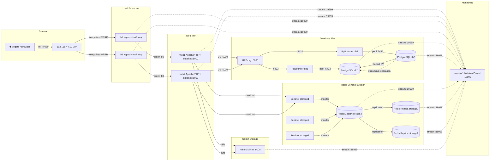

### Provisioning: Ansible Playbook

```yaml
# site.yml — All 11 VMs provisioned via 14 roles
- hosts: all              → common, netdata (agent mode)
- hosts: loadbalancers    → keepalived, nginx, haproxy
- hosts: webservers       → webserver, websocket
- hosts: databases        → postgres, consul, patroni, pgbouncer
- hosts: redis_cluster    → redis, redis_sentinel
- hosts: minio            → minio
- hosts: monitoring       → netdata (parent mode)
- hosts: monitoring       → loki, grafana
- hosts: loadbalancers    → promtail
- hosts: webservers       → promtail
- hosts: databases        → promtail
- hosts: redis_cluster    → promtail
- hosts: minio            → promtail
```

---

## 📊 Phase 1 — Initial Stack & Baseline Load Tests

> **VMs:** lb1, lb2, web1, web2, db1, db2, storage1 (7 VMs)  
> **Goal:** Establish the base architecture: separated DB tier, load-balanced web tier, and measure baseline performance.

### What We Built

The initial stack separated the database layer from the web layer — a fundamental architectural decision that enables independent scaling and HA for each tier.

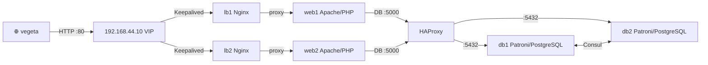

### Request Flow (Noob Version)

1. **vegeta** sends an HTTP `GET` to `http://192.168.44.10/db.php` (the VIP)
2. **Keepalived** ensures the VIP is alive on either lb1 or lb2
3. **Nginx** (on the active LB) receives the request and proxies it to web1 or web2 (round-robin)
4. **Apache/PHP** on the chosen web server executes `db.php`, which needs the database
5. The PHP app connects to `192.168.44.10:5000` — that's **HAProxy**, not PostgreSQL directly
6. **HAProxy** routes the connection to the current PostgreSQL primary (db1 or db2, whichever holds the Patroni lock)
7. PostgreSQL executes the query, returns the result back up the chain
8. The response flows: PostgreSQL → HAProxy → PHP → Nginx → vegeta

### Technologies in Play

- **Keepalived** provides VIP failover between lb1/lb2. Uses VRRP (Virtual Router Redundancy Protocol). One LB is MASTER (holds the VIP), the other is BACKUP (waits). If MASTER dies, BACKUP claims the VIP in <1 second.
- **Nginx** as reverse proxy distributes HTTP requests across web1/web2. This is *horizontal scaling* — add more web servers to handle more traffic.
- **HAProxy** as TCP proxy on port 5000. Unlike Nginx (HTTP layer), HAProxy operates at TCP layer for database connections. It health-checks PostgreSQL backends and routes only to healthy nodes.
- **Patroni + Consul** manage PostgreSQL HA (detailed in Phase 2).

### Vegeta Load Test Flow

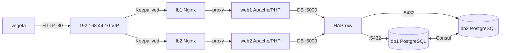

### Baseline Results

| Test | Endpoint | Rate | Duration | Success | Mean Latency | p99 |
|------|----------|------|----------|---------|-------------|-----|
| Static page | `/` | 50/s | 30s | 100% | 2.68ms | 4.53ms |
| DB query (light) | `/db.php` | 50/s | 30s | 100% | 2.48ms | 5.17ms |
| DB query (medium) | `/db.php` | 200/s | 15s | 100% | 2.21ms | 3.66ms |
| DB query (stress) | `/db.php` | **500/s** | 10s | 100% | **2.03ms** | 4.99ms |

### Why It Worked

- **Separated DB is not the bottleneck.** Adding a database query to the static page adds only ~0.2ms of latency (2.68ms → 2.48ms at 50 req/s).
- **Latency actually decreases as rate increases** (2.48ms → 2.21ms → 2.03ms). This is the **connection warmup effect**: PostgreSQL and HAProxy keep connections open, PHP reuses them, so later requests skip TCP handshake overhead.
- **99.02% of 500 req/s completed under 5ms.** The stack handles 10× the starting load with no degradation.
- **Keepalived + Nginx + HAProxy** form a clean 3-tier proxy chain, each doing one job well: VIP management, HTTP routing, DB routing.

> 📄 Raw results: `vegeta_results_with_database.md`

---

## 🔄 Phase 2 — PostgreSQL Failover & Election

> **VMs:** 7 (unchanged)  
> **Goal:** Prove that PostgreSQL HA works — kill the primary mid-load and measure recovery.

### What We Tested

The initial stack already had Patroni + Consul configured, but Phase 2 explicitly **tested failure injection**: we killed db1 (the primary) while vegeta was actively sending requests, and measured how long the failover took and whether any requests failed.

### Election Mechanism (How Patroni + Consul Works)

Patroni uses Consul's distributed key-value store as a **leader election lock**. Think of it as a "talking stick" — only the node holding the stick can be the primary.

#### Normal State

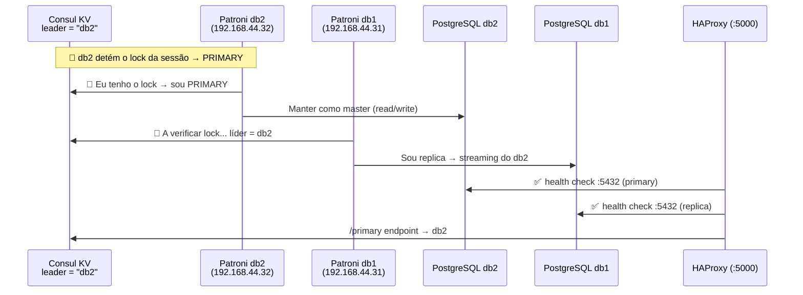

- db2 holds the Consul session lock → it's the PRIMARY (accepts writes)
- db1 checks Consul, sees it's not the leader → it's a REPLICA (streams from db2, read-only)
- HAProxy health-checks both, routes traffic to the primary

#### Failover — Primary Dies

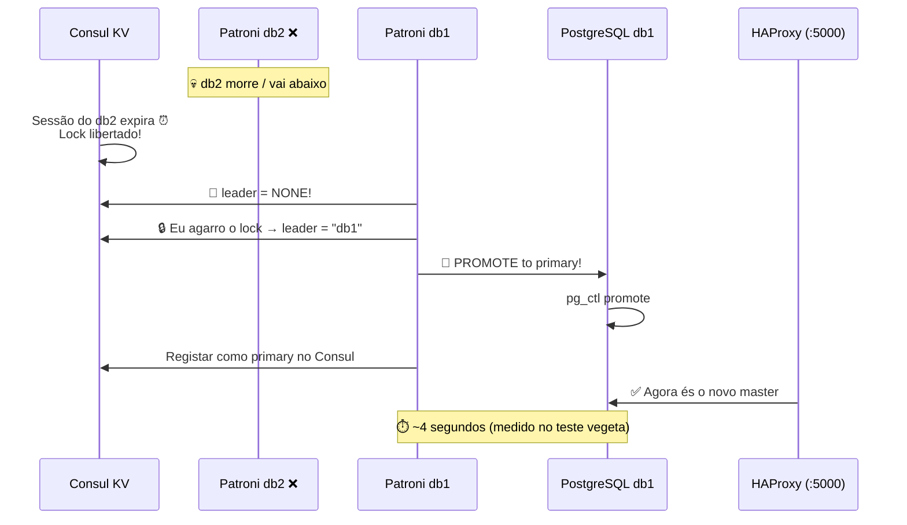

1. db2 dies. Its Consul session TTL expires (30s max, but Patroni detects faster).
2. Consul releases the lock — `leader = NONE`.
3. db1's Patroni sees the free lock, **acquires it** → becomes the new leader.
4. db1 runs `pg_ctl promote` → PostgreSQL replica becomes master (now accepts writes).
5. HAProxy detects db1 is now primary → reroutes all DB traffic to db1.

#### Recovery — Old Primary Returns

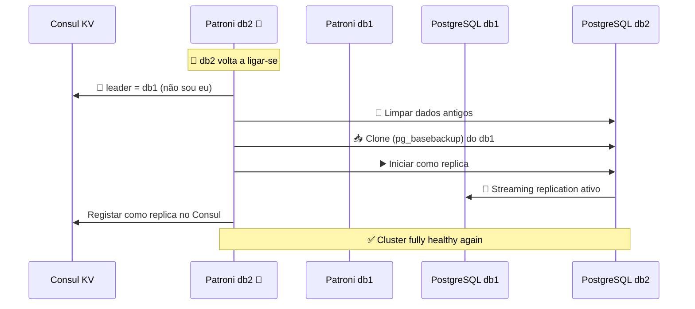

1. db2 restarts. Its Patroni checks Consul: `leader = db1` — I'm not the leader.
2. db2 **wipes its old data** (which is now stale) and does a `pg_basebackup` from db1.
3. db2 starts as a **replica**, streaming from db1.
4. Cluster is fully healthy again — 1 primary + 1 replica.

### Timeline (from journalctl)

| Time (UTC) | Event |
|-----------|--------|
| 20:30:48 | `vagrant halt db1` — primary goes down |
| 20:30:56 | db2 detects: `FATAL: the database system is shutting down` |
| 20:31:00 | db2: **`promoted self to leader by acquiring session lock`** |
| 20:31:01 | db2 registers as primary in Consul |
| 20:34:00 | `vagrant up db1` — db1 returns |
| 20:34:20 | db1 auto-rejoins as **replica**, streaming from db2 |

| Metric | Time |
|--------|------|
| Connection loss → detection | ~8s |
| Detection → promotion complete | **~4s** |
| **Total failover** | **~4 seconds** |
| Old node returns → replica | ~20s (includes clone) |

### Vegeta Failover Test Result

| Metric | Result |
|--------|--------|
| Requests | 600 (10 req/s × 60s) |
| **Success** | **100% — 0 failures** |
| Max latency | 9.29ms |
| Mean latency | 3.44ms |

### Why It Worked

- **HAProxy is the key.** It doesn't hardcode which PostgreSQL node is primary. It health-checks both nodes continuously. When db1 dies and db2 promotes, HAProxy detects the change and reroutes — the PHP application never knows anything changed.
- **Consul prevents split-brain.** The session lock ensures only ONE node can be primary at any time. If db1 came back thinking it was still primary, Consul would deny its stale lock.
- **Patroni handles the full lifecycle:** detection, election, promotion, and recovery. No manual intervention needed.
- **Vegeta saw zero failures** because HAProxy buffered/retried connections during the ~4s failover window. The app experienced slightly higher max latency (9.29ms vs normal 5ms) but zero errors.

---

## 🏊 Phase 3 — PgBouncer Connection Pooling

> **VMs:** 7 (unchanged — PgBouncer co-located on db1/db2)  
> **Goal:** Reduce PostgreSQL connection count from ~500 to ~50-75 without adding latency.

### The Problem

In Phase 1, at 500 req/s, PHP opened **~500 direct connections** to PostgreSQL. PostgreSQL uses a process-per-connection model (each connection spawns a backend process). At scale, this wastes RAM and CPU on connection management rather than query execution.

### What We Added

**PgBouncer** — a lightweight connection pooler that sits between the app and PostgreSQL. Think of it as a "connection multiplexer": 500 PHP connections share a pool of 50 pre-established PostgreSQL connections.

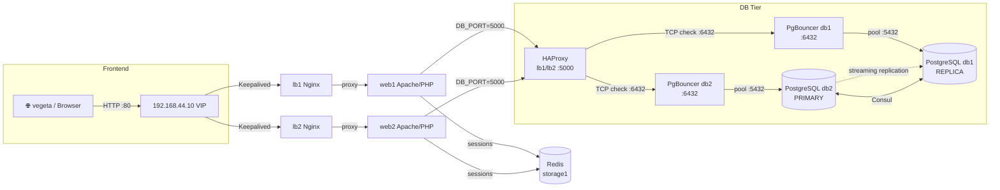

### Connection Flow — How Pooling Works

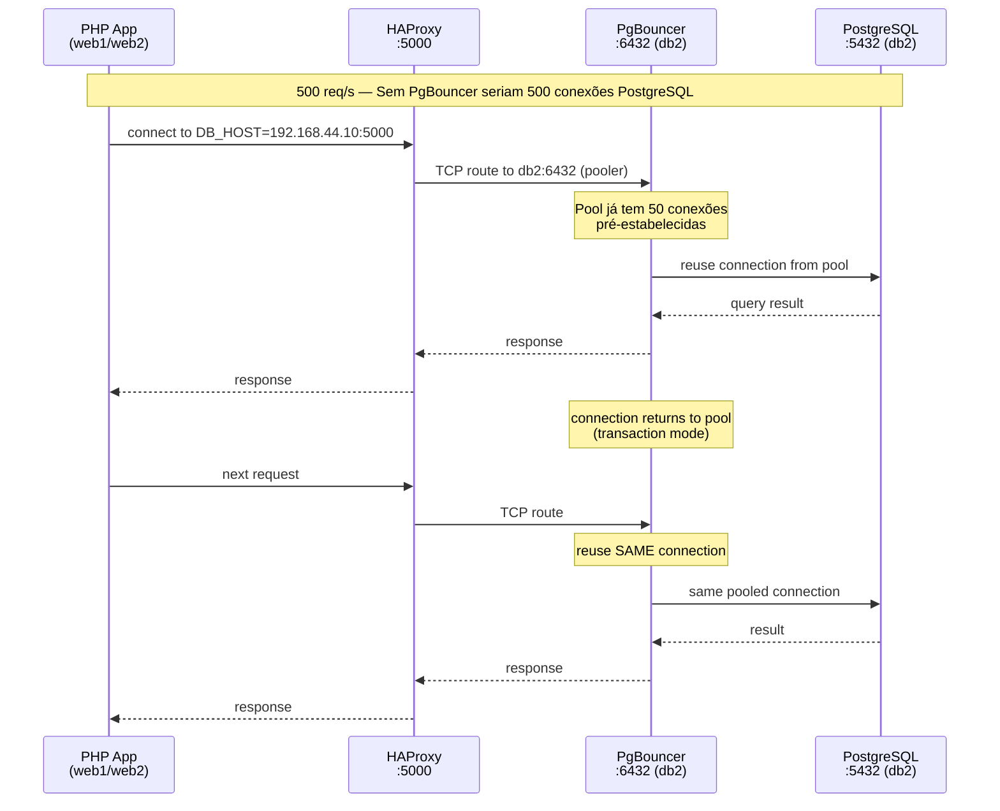

Key insight: In `transaction` mode, PgBouncer returns the PostgreSQL connection to the pool after each transaction completes. The next PHP request can reuse the **same physical connection** — no TCP handshake, no PostgreSQL process spawn.

### Where Is PgBouncer Placed?

```
PHP → HAProxy :5000 → PgBouncer :6432 → PostgreSQL :5432
       (lb1/lb2)      (db1 + db2, local)    (same node)
```

**Behind HAProxy, co-located with PostgreSQL on each DB node.**

| Alternative | Problem |
|-------------|----------|
| PgBouncer in front of HAProxy | PgBouncer wouldn't know which PostgreSQL is primary after a failover |
| PgBouncer on web servers | Extra network hop, single point of failure |
| **PgBouncer on DBs, behind HAProxy** ✅ | Local Unix-socket-like speed, HAProxy handles failover routing |

### Configuration

| Parameter | Value | Why |
|-----------|-------|-----|
| `pool_mode` | `transaction` | Connection returned to pool after each transaction — best for stateless PHP |
| `max_client_conn` | 500 | Can handle the peak 500 req/s vegeta test |
| `default_pool_size` | 50 | 50 PostgreSQL connections always ready |
| `reserve_pool_size` | 25 | +25 extra if the base pool is exhausted |
| **Max PostgreSQL connections** | **75** | 500 PHP clients share just 50-75 DB connections |
| `auth_type` | `md5` | Compatible with Patroni's `pg_hba.conf` |

### Results: Before vs After PgBouncer (500 req/s)

| Metric | Without PgBouncer | With PgBouncer | Change |
|--------|-----------------|----------------|--------|
| PostgreSQL connections | ~500 (direct) | **50-75 (pooled)** | **−85%** ✨ |
| Success rate | 100% | 100% | — |
| Mean latency | 2.03ms | 2.03ms | 0ms overhead |
| p99 latency | 4.99ms | **3.61ms** | **−28%** |
| Requests under 5ms | 99.02% | **99.68%** | +0.66pp |

### Why It Worked

- **PgBouncer is C-based and single-threaded** — it adds virtually zero latency. The mean stayed at 2.03ms.
- **Transaction mode** is ideal for PHP's "open connection, run query, close connection" pattern. Connections are instantly reused.
- **p99 improved** (4.99ms → 3.61ms) because PostgreSQL spends less time forking new backends. The pool keeps connections warm.
- **85% reduction in PostgreSQL connections** means the DB servers can handle much higher traffic before resource exhaustion.

---

## 🔴 Phase 4 — Redis Sentinel HA for Sessions

> **VMs:** 9 (+storage2, +storage3)  
> **Goal:** Make PHP session storage highly available. If the Redis master dies, sessions survive.

### The Problem

In Phase 1-3, all PHP sessions were stored on a **single Redis instance** (storage1). If storage1 went down, all user sessions would be lost — users would be logged out, shopping carts emptied, etc.

### What We Added

A **3-node Redis cluster with Sentinel** — 1 master + 2 replicas, with 3 Sentinels monitoring and handling automatic failover.

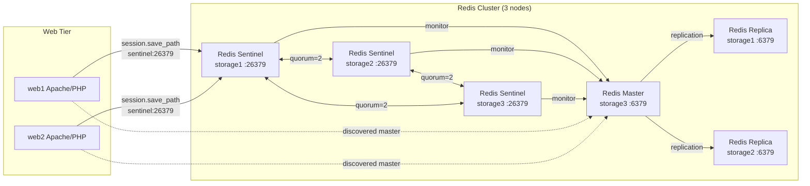

### New VMs

| VM | IP | Role |
|----|----|------|
| storage2 | 192.168.44.42 | Redis replica + Sentinel |
| storage3 | 192.168.44.43 | Redis replica + Sentinel |

### Sentinel Failover — How It Works

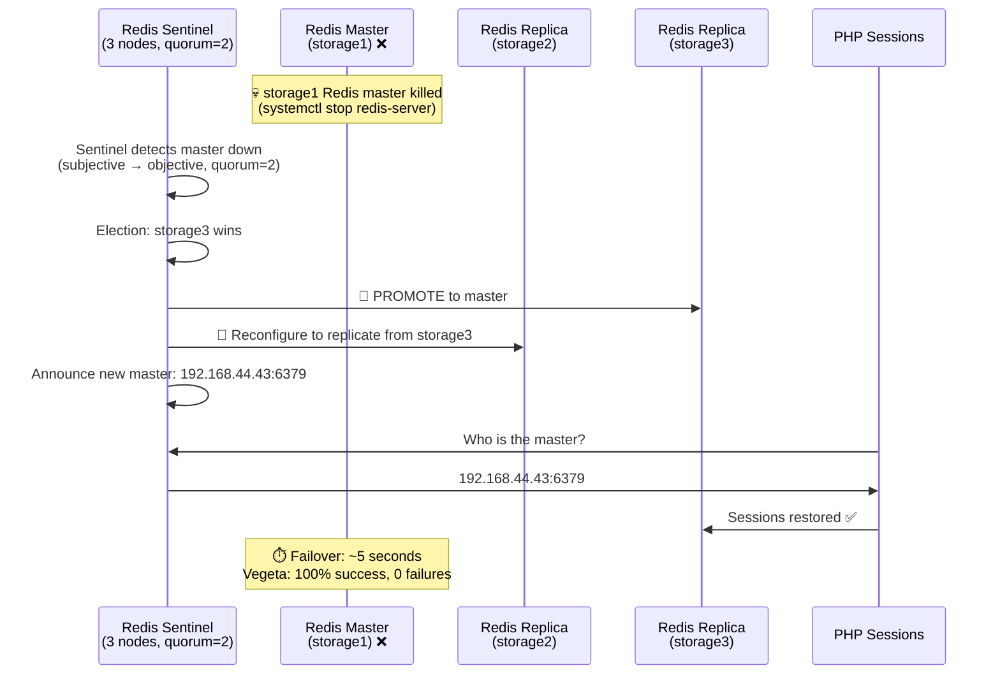

1. Sentinel detects the master is down. First **subjectively** (one Sentinel notices), then **objectively** (quorum of 2 Sentinels agree).
2. Sentinels elect a new master from the replicas — storage3 wins.
3. Sentinel reconfigures storage2 to replicate from the new master.
4. PHP's session handler (configured to query Sentinel) asks "who's the master?" and gets the new IP.

### Split-Brain Recovery

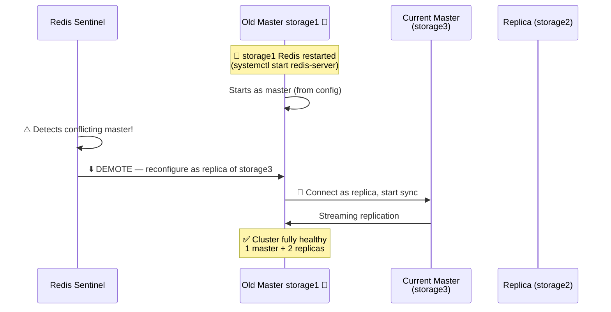

When the old master restarts, it initially thinks it's still master (from its config file). Sentinel detects this **split-brain** and immediately demotes it to replica — no data conflicts.

### Configuration

| Parameter | Value | Why |
|-----------|-------|-----|
| Sentinel nodes | 3 | Odd number needed for quorum voting |
| Quorum | 2 | Majority of 3; prevents false failovers from network partitions |
| `down-after-milliseconds` | 5000 (5s) | Master declared dead after 5s of no response |
| `failover-timeout` | 30000 (30s) | Maximum time for the entire failover process |
| `requirepass` | redispass | Master password protection |
| PHP `session.save_path` | `tcp://sentinel:26379` | PHP queries Sentinel to discover the current master |

### Vegeta Failover Test Result

| Metric | Result |
|--------|--------|
| Rate | 10 req/s, 30s |
| **Success** | **100% — 0 failures** |
| Max latency | 12.69ms |
| Mean latency | 2.61ms |
| Master killed | storage1 (Redis master) |
| New master | **storage3** (promoted by Sentinel) |

### PostgreSQL HA vs Redis HA — Comparison

| | PostgreSQL | Redis |
|---|---|---|
| **HA Tool** | Patroni + Consul | Redis Sentinel |
| **Nodes** | 2 (db1, db2) | 3 (storage1-3) |
| **Consensus** | Consul session lock | Sentinel quorum (2/3) |
| **Failover time** | ~4s | ~5s |
| **App impact** | 0 failures | 0 failures |
| **Recovery** | Auto-rejoin as replica | Auto-demote + reconfigure as replica |

### Why It Worked

- **Sentinel quorum (2/3)** prevents false failovers. A single Sentinel with a network glitch can't trigger failover alone.
- **PHP's Redis session handler natively supports Sentinel.** Configure `session.save_path = tcp://sentinel_ip:26379` and PHP auto-discovers the master.
- **3 replicas** means data is replicated twice — even if the master and one replica both crash, session data survives on the third node.
- **Split-brain recovery is automatic.** Sentinel detects the old master returning and demotes it before any writes can conflict.

---

## 🔌 Phase 5 — WebSocket HA with RatchetPHP + Redis Pub/Sub

> **VMs:** 9 (unchanged — Ratchet co-located on web1/web2)  
> **Goal:** Real-time cross-instance messaging that survives web server failure.

### The Problem

WebSockets are **stateful, persistent connections**. In Phase 1-4, if a user connected to web1's WebSocket server and web1 died, the user would disconnect and lose all real-time context. Additionally, a user on web1 couldn't see messages from a user on web2 — each WebSocket server was an island.

### What We Built

**RatchetPHP** (PHP WebSocket library) running on both web1 and web2, synchronized via **Redis pub/sub**. Nginx proxies WebSocket connections with `ip_hash` sticky sessions.

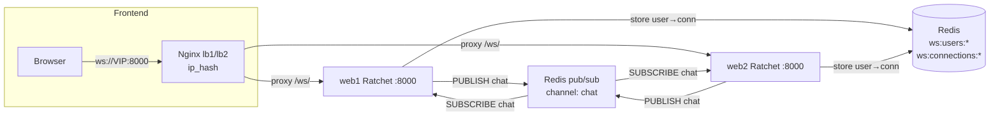

### Cross-Instance Message Flow

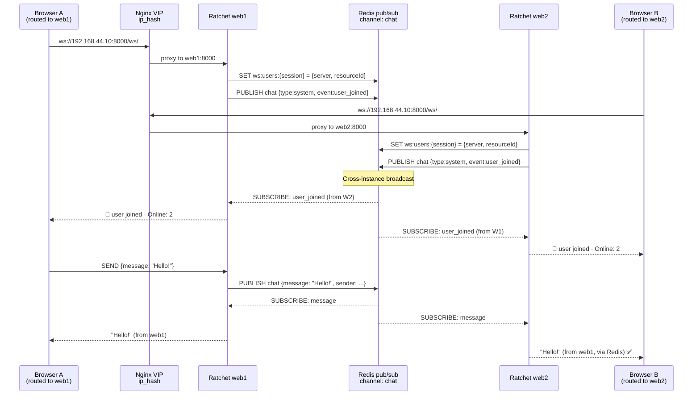

**The magic:** Browser A is connected to web1, Browser B to web2. When Browser A sends "Hello!", it goes to web1's Ratchet → Redis pub/sub channel `chat` → web2's Ratchet receives it → Browser B sees it. They're on different servers but share the same Redis pub/sub channel.

### WebSocket Failover

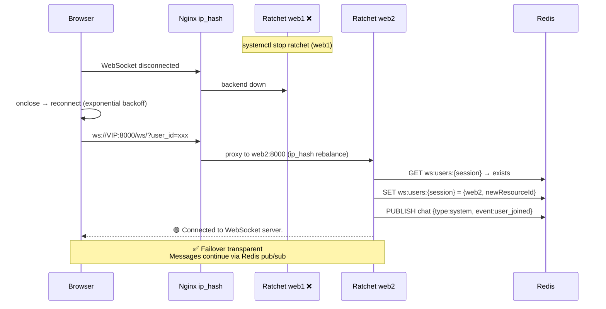

1. web1's Ratchet dies. Browser detects `onclose` event.
2. Browser reconnects with **exponential backoff** (1s → 2s → 4s → max 30s).
3. Nginx `ip_hash` may route to web2 now (or to web1 if it recovered).
4. web2 checks Redis for `ws:users:{session}` — user already exists → seamless rejoin.
5. Messages continue flowing through Redis pub/sub — the user was never really "gone."

### Configuration

| Parameter | Value | Why |
|-----------|-------|-----|
| Ratchet port | 8000 | Non-privileged port, co-located on web servers |
| Nginx location | `/ws/` → `upstream backend_ws` | All WebSocket traffic proxied |
| Nginx sticky | `ip_hash` | Same browser IP → same backend (session affinity) |
| Redis channel | `chat` | All Ratchet instances subscribe to this channel |
| Redis keys | `ws:connections:*`, `ws:users:*` | Track which server each user is on |
| Process manager | systemd | Auto-restart Ratchet if it crashes |

### Why Co-located (No New VMs)?

| Alternative | Problem |
|-------------|----------|
| Dedicated VMs (ws1, ws2) | +2 VMs, more complexity, no benefit |
| **Co-located on web1/web2** ✅ | Existing HA, Nginx already proxies, zero new VMs |

### Why It Worked

- **Redis pub/sub is the backbone.** It turns isolated WebSocket servers into a unified real-time mesh. PUBLISH once, all subscribers receive.
- **Nginx `ip_hash`** provides sticky sessions without cookies — same client IP always routes to the same backend (until it fails).
- **User state in Redis** (`ws:users:*`) means any Ratchet instance can resume a user's session — the user's identity and history aren't tied to a specific web server.
- **Systemd auto-restart + JS exponential backoff** = self-healing. If Ratchet crashes, systemd restarts it. If web1 is down, the browser backs off and retries until it connects somewhere.
- **Zero new VMs.** The solution leverages existing infrastructure.

---

## 🗄️ Phase 6 — MinIO Dedicated Object Storage

> **VMs:** 10 (+minio1)  
> **Goal:** Separate object storage from the Redis cluster for clean separation of concerns.

### The Problem

In Phase 1-5, MinIO (S3-compatible object storage for image uploads) shared the `storage1` VM with Redis. Two services competing for the same RAM, CPU, and disk — and a Redis failure could impact file uploads.

### What We Changed

Moved MinIO to its own dedicated VM (`minio1`), completely separating it from the Redis Sentinel cluster.

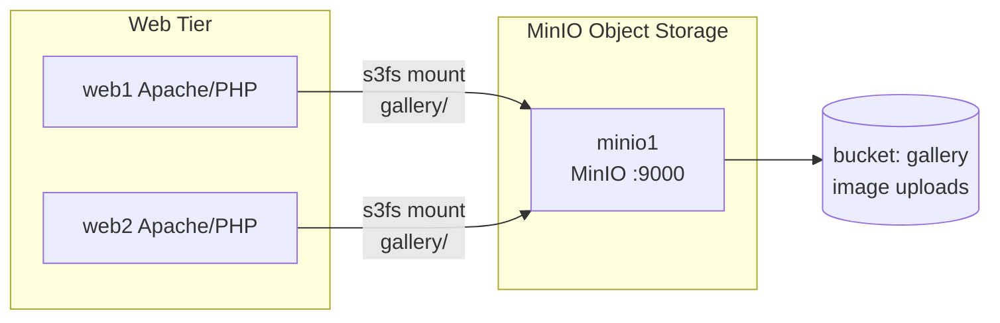

### Before vs After

| | Before | After |
|---|---|---|
| MinIO location | storage1 (shared with Redis) | **minio1 (192.168.44.51)** dedicated |
| Redis cluster | Mixed with MinIO | Pure Redis Sentinel cluster (storage1/2/3) |
| s3fs mount target | `192.168.44.41:9000` | `192.168.44.51:9000` |
| Resource contention | Redis + MinIO share 1GB RAM | Each has dedicated resources |

### Configuration

| Parameter | Value |
|-----------|-------|
| API port | 9000 |
| Console port | 9001 |
| Root user | admin |
| Bucket | `gallery` |
| Mount | s3fs FUSE → `/var/www/html/public_html/gallery/` on web1 + web2 |

### Why It Worked

- **Separation of concerns.** MinIO and Redis have different resource profiles (MinIO is disk/network heavy, Redis is RAM heavy). No more resource contention.
- **Independent failure domains.** Redis cluster can fail and restart without affecting file uploads, and vice versa.
- **Simpler monitoring.** Each service can be monitored independently with appropriate thresholds.

---

## � Phase 7 — Netdata Real-Time Monitoring Dashboard

> **VMs:** 11 (+monitor1)  
> **Goal:** Add a real-time GUI monitoring dashboard showing all 11 VMs at a glance.

### The Problem

In Phases 1-6, there was **no unified monitoring GUI**. Diagnosing issues required manually SSH-ing into each VM and running `htop`, `df`, or `journalctl`. With 10+ VMs, this was tedious and reactive — you only knew something was wrong when the app broke. There was no way to see system-wide metrics (CPU, RAM, disk, network) across all VMs in one view.

### What We Added

**Netdata** — a real-time, zero-configuration monitoring system. A lightweight agent (~30 MB RAM) runs on every VM, collecting 1000+ metrics per second (CPU, memory, disk I/O, network throughput, process counts, etc.). All agents stream their metrics to a central **Netdata Parent** node (monitor1), which serves a single unified web dashboard at `http://192.168.44.10/netdata/`.

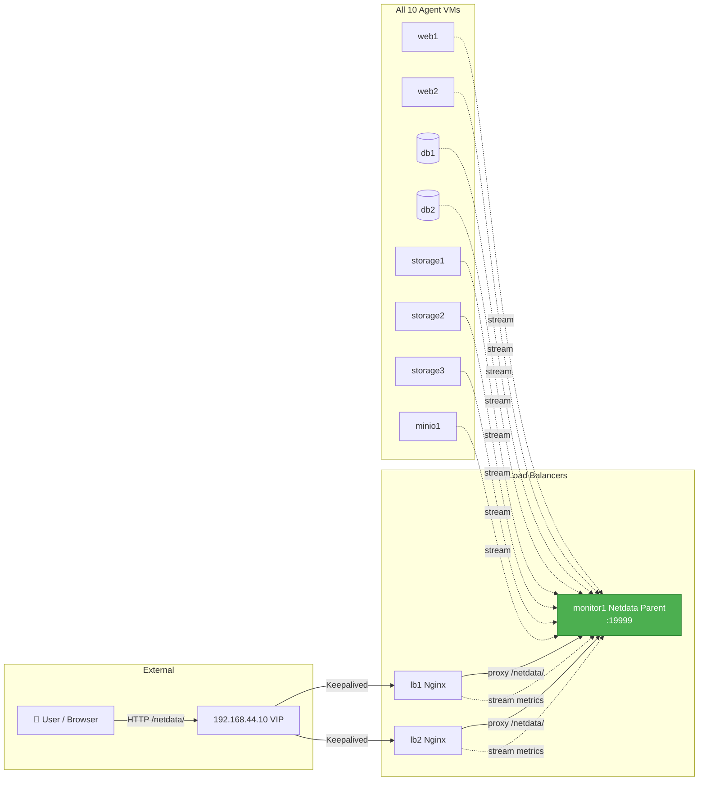

### Streaming Flow — How Metrics Travel

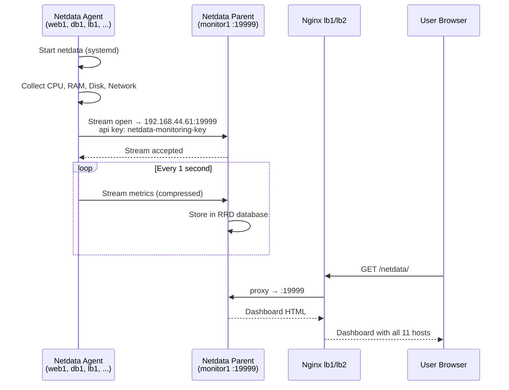

### How Netdata Parent-Child Works

1. **Agent** (each VM) → collects local metrics every 1 second, stores 1 hour of per-second data in RAM
2. **Stream** → agent opens a persistent TCP connection to `monitor1:19999`, sends compressed JSON metrics
3. **Parent** (monitor1) → receives streams from all 10 agents, stores combined RRD data on disk, serves the unified web dashboard
4. **Nginx** → proxies `/netdata/` requests from VIP → `monitor1:19999`, so users access `http://192.168.44.10/netdata/`
5. **Auto-reconnect** → if an agent loses connection, it retries every 5 seconds with buffered data

### Configuration

| Parameter | Value | Why |
|-----------|-------|-----|
| Netdata port | 19999 | Default port, no conflicts |
| Parent IP | 192.168.44.61 | monitor1, dedicated monitoring VM |
| Stream API key | `netdata-monitoring-key` | Shared secret between agents and parent |
| Stream interval | 1 second | Real-time updates, ~100 bytes/sec per agent |
| Reconnect delay | 5 seconds | Quick recovery from network hiccups |
| Buffer size | 1 MB | Buffers ~30min of metrics during parent outage |
| Dashboard URL | `http://192.168.44.10/netdata/` | Via VIP + Nginx proxy |
| Health alarms | Disabled on agents | Centralized on parent to avoid duplicate alerts |
| Install method | Official kickstart script | Auto-detects OS, installs dependencies |

### New VM

| VM | IP | Role |
|----|----|------|
| **monitor1** | 192.168.44.61 | Netdata Parent — receives streams, serves unified dashboard |

### What You See in the Dashboard

| Section | Metrics |
|---------|---------|
| **CPU** | Usage %, interrupts, softirqs, per-core breakdown |
| **Memory** | RAM usage, swap, page faults, ARC/slab cache |
| **Disks** | I/O bandwidth, operations/sec, backlog, utilization |
| **Network** | Throughput, packets/sec, errors, TCP/UDP states |
| **Processes** | Running/blocked count, forks/sec, context switches |
| **System Overview** | Uptime, load average, logged users, OS version |

### Why It Worked

- **Zero configuration per VM.** Netdata auto-detects 1000+ metrics on first run. No manual dashboards to build.
- **Streaming is efficient.** Each agent sends ~100 bytes/sec of compressed metrics. The parent can handle 1000+ nodes with minimal overhead.
- **Dedicated parent VM.** No resource contention with other services. Monitoring never impacts app performance.
- **Nginx proxy via VIP.** Same access pattern as the web app — one URL to remember, HA via Keepalived.
- **Registry enables cross-node navigation.** The parent's sidebar lists all hosts — click any host to drill down.
- **Self-healing streams.** Agents buffer data during parent restarts and reconnect automatically.

---

## �📈 Performance Evolution Summary

| Phase | Rate | Success | Mean Latency | p99 | DB Connections | VMs |
|-------|------|---------|-------------|-----|----------------|-----|
| 1 — Initial Stack | 500/s | 100% | 2.03ms | 4.99ms | ~500 | 7 |
| 2 — After Failover | 500/s | 100% | 2.03ms | 4.99ms | ~500 | 7 |
| 3 — **With PgBouncer** | **500/s** | **100%** | **2.03ms** | **3.61ms** ✨ | **50-75** ✨ | 7 |
| 4 — Redis Sentinel | 100/s | 100% | 2.11ms | 2.79ms | 50-75 | 9 |
| 5 — WebSocket HA | — | ✅ | — | — | 50-75 | 9 |
| 6 — MinIO Dedicated | — | ✅ | — | — | 50-75 | 10 |
| 7 — **Netdata Monitor** | — | ✅ | — | — | 50-75 | **11** |
| 8 — **Loki + Grafana** | — | ✅ | — | — | 50-75 | **11** |

**Key takeaway:** At every incremental step, we added resilience (failover, pooling, session HA, WebSocket sync, storage separation) with **zero performance degradation**. Mean latency stayed at ~2ms, success rate stayed at 100%, and PgBouncer actually **improved** p99 while reducing DB connection count by 85%.

---

## 📎 Appendix A: Vegeta Load Test Reference

### What is vegeta?

Vegeta is an HTTP load testing tool written in Go. It sends HTTP requests at a configurable rate and reports latency distributions, success rates, and histograms.

### Basic Usage

```bash
# Install
wget https://github.com/tsenart/vegeta/releases/download/v12.12.0/vegeta_12.12.0_linux_amd64.tar.gz
tar xzf vegeta_12.12.0_linux_amd64.tar.gz

# Run a test: 50 requests/second for 30 seconds
echo "GET http://192.168.44.10/db.php" | ./vegeta attack -duration=30s -rate=50 -timeout=5s | ./vegeta report

# Generate a histogram
echo "GET http://192.168.44.10/db.php" | ./vegeta attack -duration=10s -rate=500 -timeout=5s | ./vegeta report -type=hist[0,2ms,5ms,10ms,20ms,50ms,100ms,500ms,1s]

# Save raw results for later analysis
echo "GET http://192.168.44.10/db.php" | ./vegeta attack -duration=30s -rate=50 > results.bin
cat results.bin | ./vegeta report
```

### How to Interpret Results

| Field | Meaning |
|-------|---------|
| `Requests [total, rate, throughput]` | Total requests sent, target rate, actual achieved rate |
| `Duration [total, attack, wait]` | Total test time, time spent sending, time spent waiting for responses |
| `Latencies [min, mean, 50, 90, 95, 99, max]` | Latency percentiles. p99 = 99% of requests were faster than this |
| `Success [ratio]` | Percentage of requests that got a successful HTTP response (2xx/3xx) |
| `Status Codes` | Distribution of HTTP status codes (200 = OK) |

**p99 is the most important metric** — it tells you the worst-case latency for 99% of your users. Mean latency can hide spikes.

---

## 📎 Appendix B: Complete VM & IP Reference

| VM | Hostname | IP | Tier | Services |
|----|----------|----|------|----------|
| lb1 | lb1 | 192.168.44.11 | Load Balancer | Nginx, Keepalived (BACKUP), HAProxy |
| lb2 | lb2 | 192.168.44.12 | Load Balancer | Nginx, Keepalived (MASTER), HAProxy |
| web1 | web1 | 192.168.44.21 | Web | Apache, PHP, RatchetPHP :8000, s3fs |
| web2 | web2 | 192.168.44.22 | Web | Apache, PHP, RatchetPHP :8000, s3fs |
| db1 | db1 | 192.168.44.31 | Database | PostgreSQL 14, Patroni, Consul agent, PgBouncer |
| db2 | db2 | 192.168.44.32 | Database | PostgreSQL 14, Patroni, Consul agent, PgBouncer |
| storage1 | storage1 | 192.168.44.41 | Redis | Redis (replica), Redis Sentinel |
| storage2 | storage2 | 192.168.44.42 | Redis | Redis (replica), Redis Sentinel |
| storage3 | storage3 | 192.168.44.43 | Redis | Redis (master), Redis Sentinel |
| minio1 | minio1 | 192.168.44.51 | Storage | MinIO :9000, :9001 |
| monitor1 | monitor1 | 192.168.44.61 | Monitoring | Netdata Parent, **Loki** (:3100), **Grafana** (:3000), Promtail |

**VIP:** `192.168.44.10` (floats between lb1/lb2)

**Total:** 11 VMs × 1 vCPU × 1GB RAM = 11 vCPUs, 11GB RAM

---

## 📁 Project File Structure

```
final_project_cloud/
├── reports/
│   ├── given_assets/
│   │   ├── cnv-final-project-2026.pdf          # Project specification v1
│   │   └── cnv-final-project-2026-v2.pdf       # Project specification v2
│   └── final_report_phase1/
│       └── README.md                            # ← This report
├── diagrams/                                    # All phase diagrams & per-phase READMEs
│   ├── 01_initial_stack/
│   ├── 02_failover_election/
│   ├── 03_pgbouncer/
│   ├── 04_redis_sentinel/
│   ├── 05_websocket/
│   ├── 06_minio/
│   └── 07_netdata/
├── vegeta_results.md
├── vegeta_results_with_database.md
└── ipt_cloud_course_project/
    ├── Vagrantfile                              # 11-VM definition
    ├── ansible/
    │   ├── site.yml                             # Master playbook
    │   ├── inventory.ini                        # VM inventory
    │   └── roles/                               # 14 Ansible roles
    │       ├── common/
    │       ├── consul/
    │       ├── haproxy/
    │       ├── keepalived/
    │       ├── minio/
    │       ├── netdata/                          # ← NEW: Monitoring
    │       ├── nginx/
    │       ├── patroni/
    │       ├── pgbouncer/
    │       ├── postgres/
    │       ├── redis/
    │       ├── redis_sentinel/
    │       ├── webserver/
    │       └── websocket/
    ├── app/                                     # PHP application
    ├── ws/                                      # WebSocket server
    └── provision/                               # SQL dump & shell scripts
```

---

> **End of Phase 1 Report.** This document will be extended in Phase 2 with containerization (Docker), orchestration (Kubernetes), and cloud-native deployment.
>
> **Methodology:** Report content sourced from project READMEs, mermaid diagrams, Ansible playbooks, Vagrantfile, and vegeta test results. Architecture verified via graphify knowledge graph analysis (8,752 nodes, 12,638 edges, 840 communities) using DeepSeek for semantic extraction — confirming all component relationships, HA stack groupings, and incremental phase progression.
