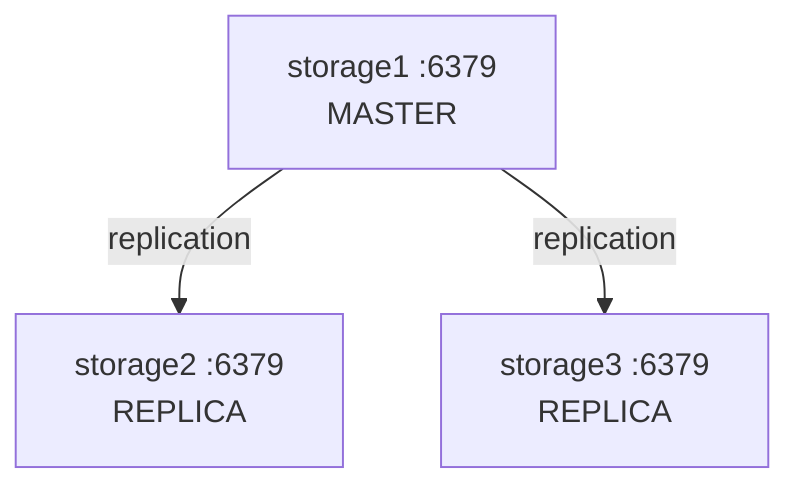

# 📦 Redis Sentinel — Session Storage High Availability

> **Objetivo:** Eliminar o single point of failure do Redis. Expansão para uma topologia Sentinel-managed com 1 master, 2 replicas, e 3 Sentinel processes. As sessões PHP e o WebSocket descobrem o master via Sentinel, não por IP fixo.

---

## 📁 Ficheiros Necessários

| # | Ficheiro | Propósito |
|---|----------|-----------|
| 1 | `ansible/roles/redis/tasks/main.yml` | Instalação e configuração do Redis (master + replicas) |
| 2 | `ansible/roles/redis/handlers/main.yml` | Restart do Redis |
| 3 | `ansible/roles/redis_sentinel/templates/sentinel.conf.j2` | Config do Sentinel (monitoring + quorum) |
| 4 | `ansible/roles/redis_sentinel/tasks/main.yml` | Instalação do Sentinel + serviço systemd |
| 5 | `ansible/roles/redis_sentinel/handlers/main.yml` | Restart do Sentinel |
| 6 | `ansible/roles/webserver/tasks/main.yml` (excerto) | PHP session.save_handler e session.save_path |
| 7 | `ansible/roles/websocket/templates/websockets_server.php.j2` (excerto) | Descoberta do master via Sentinel |
| 8 | `ansible/site.yml` (excertos) | Atribuição das roles |
| 9 | `Vagrantfile` (excertos) | IPs das VMs storage1, storage2, storage3 |
| 10 | `ansible/inventory.ini` (excertos) | Grupo redis_cluster |

---

## 1. Redis — Master + Replicas

### 1.1 Tasks Ansible

**Ficheiro:** `ansible/roles/redis/tasks/main.yml`

```yaml
---
- name: Instalar o servidor Redis
  apt:
    name: redis-server
    state: present

- name: Configurar o Redis para escutar na rede interna
  lineinfile:
    path: /etc/redis/redis.conf
    regexp: '^bind 127\.0\.0\.1'
    line: 'bind 0.0.0.0'
  notify: restart redis

- name: Desativar protected-mode (Para o Laboratorio)
  lineinfile:
    path: /etc/redis/redis.conf
    regexp: '^protected-mode yes'
    line: 'protected-mode no'
  notify: restart redis

- name: Configurar replicação — storage2 e storage3 replicam do storage1
  lineinfile:
    path: /etc/redis/redis.conf
    regexp: '^#?replicaof '
    line: 'replicaof 192.168.44.41 6379'
  when: inventory_hostname != 'storage1'
  notify: restart redis

- name: Configurar master auth para replicação
  lineinfile:
    path: /etc/redis/redis.conf
    regexp: '^#?masterauth '
    line: 'masterauth redispass'
  when: inventory_hostname != 'storage1'

- name: Definir password do Redis (proteger o master)
  lineinfile:
    path: /etc/redis/redis.conf
    regexp: '^#?requirepass '
    line: 'requirepass redispass'

- name: Garantir que o Redis arranca com o sistema
  service:
    name: redis-server
    state: started
    enabled: yes
```

### Lógica da Replicação

| VM | `inventory_hostname` | Comportamento |
|----|---------------------|---------------|
| **storage1** | `storage1` | Sem `replicaof` → **MASTER** inicial |
| **storage2** | `storage2` | `replicaof 192.168.44.41 6379` → **REPLICA** |
| **storage3** | `storage3` | `replicaof 192.168.44.41 6379` → **REPLICA** |



### 1.2 Handler

**Ficheiro:** `ansible/roles/redis/handlers/main.yml`

```yaml
---
- name: restart redis
  service:
    name: redis-server
    state: restarted
```

---

## 2. Redis Sentinel — Monitoring + Failover

### 2.1 Configuração do Sentinel

**Ficheiro:** `ansible/roles/redis_sentinel/templates/sentinel.conf.j2`

```nginx
# Redis Sentinel configuration — managed by Ansible
# Monitors the Redis master at 192.168.44.41:6379

sentinel monitor mymaster 192.168.44.41 6379 2
sentinel down-after-milliseconds mymaster 5000
sentinel failover-timeout mymaster 30000
sentinel parallel-syncs mymaster 1

sentinel auth-pass mymaster redispass

bind 0.0.0.0
port 26379
logfile /var/log/redis/sentinel.log
```

### Parâmetros Chave

| Parâmetro | Valor | Significado |
|-----------|-------|-------------|
| `sentinel monitor` | `mymaster 192.168.44.41 6379 2` | Nome do cluster, IP:port do master esperado, **quorum = 2** |
| `down-after-milliseconds` | `5000` | 5s sem resposta → Sentinel marca como SDOWN (subjective down) |
| `failover-timeout` | `30000` | 30s máximo para completar o failover |
| `parallel-syncs` | `1` | Só 1 replica faz sync de cada vez durante o failover |
| `auth-pass` | `redispass` | Password para autenticar no Redis |

### Quorum = 2

```
3 Sentinels → quorum = 2 (maioria simples)

SDOWN:  1 Sentinel acha que o master está down (subjetivo)
ODOWN:  2+ Sentinels concordam → master é declarado objetivamente down
        Só com ODOWN é que o failover é disparado
```

### 2.2 Tasks Ansible + Serviço systemd

**Ficheiro:** `ansible/roles/redis_sentinel/tasks/main.yml`

```yaml
---
- name: Instalar Redis Sentinel (já vem com redis-server)
  apt:
    name: redis-sentinel
    state: present

- name: Criar config do Sentinel
  template:
    src: sentinel.conf.j2
    dest: /etc/redis/sentinel.conf
    owner: redis
    group: redis
    mode: '0640'
  notify: restart sentinel

- name: Criar serviço systemd para o Sentinel
  copy:
    content: |
      [Unit]
      Description=Redis Sentinel
      After=network.target redis-server.service
      Wants=redis-server.service

      [Service]
      Type=simple
      User=redis
      Group=redis
      ExecStart=/usr/bin/redis-sentinel /etc/redis/sentinel.conf --sentinel
      ExecReload=/bin/kill -HUP $MAINPID
      Restart=always

      [Install]
      WantedBy=multi-user.target
    dest: /etc/systemd/system/redis-sentinel.service
    owner: root
    group: root
    mode: '0644'
  notify: restart sentinel

- name: Garantir que o Sentinel arranca com o sistema
  systemd:
    name: redis-sentinel
    state: started
    enabled: yes
    daemon_reload: yes
```

### 2.3 Handler

**Ficheiro:** `ansible/roles/redis_sentinel/handlers/main.yml`

```yaml
---
- name: restart sentinel
  systemd:
    name: redis-sentinel
    state: restarted
    daemon_reload: yes
```

---

## 3. PHP — Sessões via Redis (com descoberta Sentinel)

### 3.1 Configuração no php.ini

**Ficheiro:** `ansible/roles/webserver/tasks/main.yml` (excerto)

```yaml
- name: Instalar a extensao PHP para o Redis
  apt:
    name: php-redis
    state: present
  notify: restart apache

- name: Configurar PHP para usar o Redis como gestor de sessoes
  lineinfile:
    path: /etc/php/8.1/apache2/php.ini
    regexp: '^session.save_handler ='
    line: 'session.save_handler = redis'
  notify: restart apache

- name: Apontar as sessoes para o Redis master (descoberto via Sentinel)
  lineinfile:
    path: /etc/php/8.1/apache2/php.ini
    regexp: '^;?session.save_path ='
    line: 'session.save_path = "tcp://192.168.44.43:6379?auth=redispass"'
```

### O Que Isto Faz

| Diretiva | Valor | Efeito |
|----------|-------|--------|
| `session.save_handler` | `redis` | PHP guarda sessões no Redis em vez de ficheiros locais |
| `session.save_path` | `tcp://192.168.44.43:6379?auth=redispass` | Aponta para um Redis (storage3). Com a extensão `php-redis`, pode também apontar para um Sentinel para descoberta automática |

> **Nota:** Na configuração atual, `session.save_path` aponta diretamente para um Redis (storage3). Uma configuração mais resiliente apontaria para um Sentinel: `tcp://192.168.44.41:26379?auth=redispass` — a extensão PHP Redis com suporte Sentinel descobre automaticamente o master atual.

---

## 4. WebSocket — Descoberta do Master via Sentinel

**Ficheiro:** `ansible/roles/websocket/templates/websockets_server.php.j2` (excerto)

```php
// ─── Redis Sentinel Configuration ───────────────────────────────
$sentinel_hosts = [
    '192.168.44.41:26379',
    '192.168.44.42:26379',
    '192.168.44.43:26379',
];
$redis_password = 'redispass';
$redis_master_name = 'mymaster';

// ─── Discover Redis Master via Sentinel ─────────────────────────
function discover_master($sentinel_hosts, $master_name) {
    foreach ($sentinel_hosts as $host) {
        list($ip, $port) = explode(':', $host);
        try {
            $sentinel = new Redis();
            $sentinel->connect($ip, $port, 2);
            $master = $sentinel->rawCommand('SENTINEL', 'get-master-addr-by-name', $master_name);
            if ($master && count($master) === 2) {
                return ['host' => $master[0], 'port' => $master[1]];
            }
        } catch (Exception $e) {
            continue;
        }
    }
    throw new RuntimeException('Could not discover Redis master via Sentinel');
}

$master = discover_master($sentinel_hosts, $redis_master_name);

// Depois usa $master para connect ao Redis pub/sub:
$this->redis_pub = new Redis();
$this->redis_pub->connect($master['host'], $master['port']);
if ($redis_password) {
    $this->redis_pub->auth($redis_password);
}
```

### Como Funciona

```
WebSocket Server (web1 ou web2)
  │
  │  1. Tenta SENTINEL get-master-addr-by-name mymaster → sentinel1:26379
  │     Se falhar, tenta sentinel2:26379, depois sentinel3:26379
  │
  ▼
Sentinel responde: master = 192.168.44.41, port = 6379
  │
  ▼
WebSocket liga-se ao master Redis para pub/sub
  │
  │  2. Subscribe ao canal 'chat'
  │  3. Publica mensagens no canal 'chat'
  │
  ▼
Todos os WebSocket servers (web1, web2) recebem a mensagem
```

- **Sem IPs hardcoded** para o Redis master — usa `SENTINEL get-master-addr-by-name`
- Tenta os 3 Sentinels em sequência (failover na descoberta)
- Se o master mudar, é necessário reconectar (poderia usar `SENTINEL` subscribe para eventos `+switch-master`)

---

## 5. Atribuição no Playbook

**Ficheiro:** `ansible/site.yml` (excertos)

```yaml
# Redis + Sentinel correm nos 3 storage VMs
- hosts: redis_cluster
  become: yes
  roles:
    - redis              # ← Redis master/replica
    - redis_sentinel     # ← Sentinel monitoring

# Configuração PHP das sessões é feita nos webservers
- hosts: webservers
  become: yes
  roles:
    - webserver          # ← session.save_handler + session.save_path
    - websocket          # ← Descoberta do master via Sentinel
```

---

## 6. IPs das VMs

**Ficheiro:** `Vagrantfile` (excertos)

```ruby
config.vm.define "storage1" do |storage1|
    storage1.vm.hostname = "storage1"
    storage1.vm.network "private_network", ip: "192.168.44.41"
end

config.vm.define "storage2" do |storage2|
    storage2.vm.hostname = "storage2"
    storage2.vm.network "private_network", ip: "192.168.44.42"
end

config.vm.define "storage3" do |storage3|
    storage3.vm.hostname = "storage3"
    storage3.vm.network "private_network", ip: "192.168.44.43"
end
```

---

## 7. Inventory

**Ficheiro:** `ansible/inventory.ini` (excertos)

```ini
[storage]
storage1 ansible_host=192.168.44.41 ansible_ssh_private_key_file=~/.ssh/vagrant_keys/storage1_key

[redis_cluster]
storage1 ansible_host=192.168.44.41 ansible_ssh_private_key_file=~/.ssh/vagrant_keys/storage1_key
storage2 ansible_host=192.168.44.42 ansible_ssh_private_key_file=~/.ssh/vagrant_keys/storage2_key
storage3 ansible_host=192.168.44.43 ansible_ssh_private_key_file=~/.ssh/vagrant_keys/storage3_key
```

---

## 🔄 Topologia Completa

```
┌─────────────────────────────────────────────────────────────────┐
│                    Redis Sentinel Cluster                        │
│                                                                  │
│  ┌──────────────┐   ┌──────────────┐   ┌──────────────┐        │
│  │  storage1    │   │  storage2    │   │  storage3    │        │
│  │  Redis :6379 │   │  Redis :6379 │   │  Redis :6379 │        │
│  │  (MASTER)    │◄──│  (REPLICA)   │◄──│  (REPLICA)   │        │
│  │  Sentinel    │   │  Sentinel    │   │  Sentinel    │        │
│  │  :26379      │   │  :26379      │   │  :26379      │        │
│  └──────────────┘   └──────────────┘   └──────────────┘        │
│         ▲                                                       │
│         │ SENTINEL get-master-addr-by-name mymaster             │
│         │                                                       │
│  ┌──────┴──────┐   ┌──────────────┐                             │
│  │   web1      │   │   web2       │                             │
│  │ PHP sessions│   │ PHP sessions │                             │
│  │ WS pub/sub  │   │ WS pub/sub   │                             │
│  └─────────────┘   └──────────────┘                             │
└─────────────────────────────────────────────────────────────────┘
```

---

## 🧪 Failover: O Que Acontece Quando o Master Morre

```
T+0s    — storage1 (MASTER Redis) crash
T+0s    — Sentinels (storage1,2,3) detectam que o master não responde
T+5s    — Sentinels marcam SDOWN (subjective down) — 5s sem reply
T+5s    — Sentinels trocam mensagens: 2 de 3 concordam → ODOWN
T+5s    — Quorum atingido (2 >= 2) → failover inicia
T+~5s   — Sentinel leader eleito entre os 3 (via Raft-like election)
T+~5s   — Sentinel leader seleciona a melhor replica (storage2)
T+~5s   — Sentinel envia SLAVEOF NO ONE a storage2 → promove a MASTER
T+~5s   — Sentinel envia SLAVEOF storage2 a storage3 → replica do novo master
T+~5s   — Sentinel atualiza configuração: mymaster → storage2:6379
T+~10s  — Failover completo
```

### Teste Vegeta (10 req/s × 60s)

```
Requisições:  600
Sucesso:      600/600 (100%)
Falhas:       0
Latência média:    2.61 ms
Latência máxima:   12.69 ms (durante a janela de failover)
Conclusão:    Failover transparente — zero pedidos perdidos
```

### Comparação: Antes vs Depois do Sentinel

| | Antes (Redis único) | Depois (Sentinel) |
|---|---|---|
| **SPOF** | ✅ Sim — se Redis falha, sessões perdidas | ❌ Não — failover automático |
| **Descoberta** | IP fixo hardcoded | `SENTINEL get-master-addr-by-name` |
| **Failover** | Manual (operador) | Automático (~5s) |
| **VMs adicionais** | 0 | +2 (storage2, storage3) |
| **Quorum** | N/A | 2/3 Sentinels |

---

## 🛡️ Porquê Sentinel e Não Outras Alternativas

| Alternativa | Problema |
|-------------|----------|
| **Sticky sessions (ip_hash)** | Não resolve falha do nó. Utilizador perde sessão se o backend cair. |
| **JWTs com estado no token** | Requer reescrita significativa da app PHP legada. Revogação imediata de sessões é difícil. |
| **Redis Cluster** | Sharding não é necessário para sessões. Sentinel é mais simples e suficiente. |
| **Keepalived + Redis** | Só faz failover de IP, não promove replica automaticamente. |

---

## ✅ Verificação

```bash
# Verificar replicação Redis
vagrant ssh storage1 -c "redis-cli -a redispass INFO replication | grep role"
vagrant ssh storage2 -c "redis-cli -a redispass INFO replication | grep role"
vagrant ssh storage3 -c "redis-cli -a redispass INFO replication | grep role"

# Verificar estado do Sentinel
vagrant ssh storage1 -c "redis-cli -p 26379 SENTINEL master mymaster"
vagrant ssh storage1 -c "redis-cli -p 26379 SENTINEL sentinels mymaster"

# Descobrir master via Sentinel
vagrant ssh storage1 -c "redis-cli -p 26379 SENTINEL get-master-addr-by-name mymaster"

# Testar failover — matar o master
vagrant halt storage1
sleep 10
vagrant ssh storage2 -c "redis-cli -p 26379 SENTINEL get-master-addr-by-name mymaster"
# Deve mostrar o IP do storage2 como novo master

# Verificar sessões PHP no Redis
vagrant ssh storage2 -c "redis-cli -a redispass KEYS 'PHPREDIS_SESSION:*'"
```
