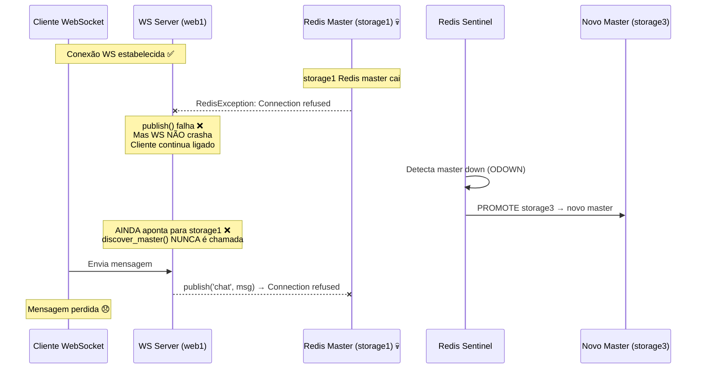
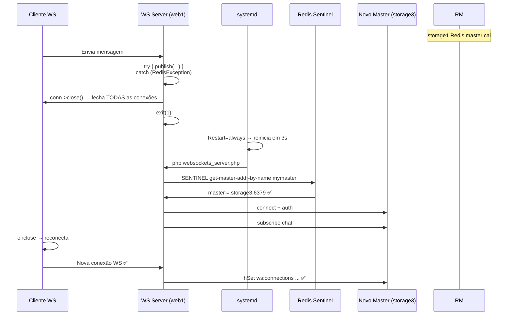

# 🔄 WebSocket — Reconexão Automática após Failover do Redis

> **Objetivo:** Corrigir a limitação do WebSocket Server que, após um failover do Redis Sentinel, mantém a conexão TCP com o cliente ativa mas com o pub/sub cross-server inoperacional. A solução usa `try-catch` + `systemd Restart=always` para forçar a redescoberta do novo master Redis via Sentinel.

---

## 📋 Problema Identificado

### Contexto

O WebSocket Server (`websockets_server.php`) descobre o master Redis via Sentinel **apenas uma vez**, no arranque:

```php
// ⚠️ Só corre no startup — NUNCA mais
$master = discover_master($sentinel_hosts, $redis_master_name);
$this->redis_pub = new Redis();
$this->redis_pub->connect($master['host'], $master['port']);
```

Quando o master Redis cai e o Sentinel promove uma réplica, o WebSocket Server **não redescobre** o novo master. Resultado:

| Elemento | Estado após failover |
|----------|---------------------|
| Conexão WS cliente ↔ servidor | ✅ TCP intacto (não cai) |
| Redis pub/sub cross-server | ❌ Partido — aponta para o master morto |
| User tracking (`ws:connections`, `ws:users`) | ❌ Inacessível |
| Descoberta do novo master | ❌ Não acontece — `discover_master()` nunca é chamada de novo |

### Diagrama do Problema



---

## 🛠️ Solução Proposta: Try-Catch + Systemd Restart

### Estratégia

1. Envolver **todas as operações Redis** em blocos `try-catch`
2. Quando uma `RedisException` é capturada → fechar **todas** as conexões WebSocket ativas
3. Terminar o processo com `exit(1)`
4. O `systemd` (configurado com `Restart=always`) reinicia o processo em 3 segundos
5. No arranque, `discover_master()` é chamada de novo → encontra o novo master ✅
6. Clientes WebSocket detetam `onclose` e reconectam automaticamente

### Diagrama da Solução



---

## 💻 Implementação

### Ficheiro Modificado

**Ficheiro:** `app/ws/websockets_server.php` (Docker + VMs)

### Código Original (problemático)

```php
public function onMessage(ConnectionInterface $from, $message)
{
    $data = json_decode($message, true);
    if (!$data) return;

    $data['timestamp'] = date('Y-m-d H:i:s');
    $data['sender_resourceId'] = $from->resourceId;

    // ❌ Se Redis caiu, lança RedisException NÃO apanhada
    $info = $this->redis_pub->hGet('ws:connections', $from->resourceId);
    if ($info) {
        $conn_info = json_decode($info, true);
        $data['sender_user_id'] = $conn_info['user_id'] ?? 'unknown';
    }

    if (isset($data['message'])) {
        $data['message'] = htmlspecialchars($data['message'], ENT_QUOTES, 'UTF-8');
    }

    // ❌ Se Redis caiu, lança RedisException NÃO apanhada
    $this->redis_pub->publish('chat', json_encode($data));
}
```

### Código Corrigido (com try-catch)

```php
public function onMessage(ConnectionInterface $from, $message)
{
    $data = json_decode($message, true);
    if (!$data) return;

    $data['timestamp'] = date('Y-m-d H:i:s');
    $data['sender_resourceId'] = $from->resourceId;

    try {
        // Get user_id from Redis (cross-instance user tracking)
        $info = $this->redis_pub->hGet('ws:connections', $from->resourceId);
        if ($info) {
            $conn_info = json_decode($info, true);
            $data['sender_user_id'] = $conn_info['user_id'] ?? 'unknown';
        }

        if (isset($data['message'])) {
            $data['message'] = htmlspecialchars($data['message'], ENT_QUOTES, 'UTF-8');
        }

        // Publish to Redis → all server instances receive it
        $this->redis_pub->publish('chat', json_encode($data));

    } catch (RedisException $e) {
        // 🔥 Redis master caiu — fecha todas as conexões WS
        //    O systemd vai reiniciar o processo (Restart=always)
        //    e no arranque discover_master() encontra o novo master
        echo "[{$this->server_id}] Redis failure: {$e->getMessage()}\n";
        echo "[{$this->server_id}] Closing all WebSocket connections...\n";

        foreach ($this->clients as $client) {
            try {
                $client->close();
            } catch (\Exception $closeError) {
                // Ignora erros ao fechar — o importante é sair
            }
        }

        // Exit → systemd Restart=always reinicia em 3s
        exit(1);
    }
}
```

### onOpen — Também Protegido

```php
public function onOpen(ConnectionInterface $conn)
{
    $query_string = $conn->httpRequest->getUri()->getQuery();
    parse_str($query_string, $params);
    $user_id = $params['user_id'] ?? 'anon_' . $conn->resourceId;

    $this->clients->attach($conn);

    try {
        // Store in Redis: user → connection info
        $info = json_encode([
            'server'     => $this->server_id,
            'resourceId' => $conn->resourceId,
            'user_id'    => $user_id,
            'connected_at' => date('c'),
        ]);
        $this->redis_pub->hSet('ws:connections', $conn->resourceId, $info);
        $this->redis_pub->hSet('ws:users', $user_id, $conn->resourceId);
        $this->redis_pub->expire('ws:users', 86400);

        echo "[{$this->server_id}] New connection: {$conn->resourceId} (user: {$user_id})\n";

        // Notify everyone about the new user
        $this->broadcast([
            'type'       => 'system',
            'event'      => 'user_joined',
            'user_id'    => $user_id,
            'online_count' => $this->redis_pub->hLen('ws:connections'),
            'timestamp'  => date('Y-m-d H:i:s'),
        ]);

    } catch (RedisException $e) {
        // Se Redis está em baixo quando um user se conecta,
        // fecha a conexão — o cliente reconecta quando o Redis voltar
        echo "[{$this->server_id}] Redis down on new connection: {$e->getMessage()}\n";
        $conn->close();
    }
}
```

### onClose — Também Protegido

```php
public function onClose(ConnectionInterface $conn)
{
    $this->clients->detach($conn);

    try {
        $info = $this->redis_pub->hGet('ws:connections', $conn->resourceId);
        $user_id = 'unknown';
        if ($info) {
            $conn_info = json_decode($info, true);
            $user_id = $conn_info['user_id'] ?? 'unknown';
        }

        // Cleanup Redis
        $this->redis_pub->hDel('ws:connections', $conn->resourceId);
        $this->redis_pub->hDel('ws:users', $user_id);

        echo "[{$this->server_id}] Connection {$conn->resourceId} disconnected (user: {$user_id})\n";

        $this->broadcast([
            'type'       => 'system',
            'event'      => 'user_left',
            'user_id'    => $user_id,
            'online_count' => $this->redis_pub->hLen('ws:connections'),
            'timestamp'  => date('Y-m-d H:i:s'),
        ]);

    } catch (RedisException $e) {
        // Redis está em baixo, limpeza local é suficiente
        echo "[{$this->server_id}] Redis down on close, local cleanup only\n";
    }
}
```

---

## ⚙️ systemd — Restart Automático

O serviço Ratchet já está configurado com `Restart=always`:

**Ficheiro:** `ansible/roles/websocket/tasks/main.yml` (excerto)

```ini
[Unit]
Description=RatchetPHP WebSocket Server
After=network.target

[Service]
Type=simple
User=root
WorkingDirectory=/var/www/html/ws
ExecStart=/usr/bin/php /var/www/html/ws/websockets_server.php
ExecReload=/bin/kill -HUP $MAINPID
Restart=always     # ← Reinicia automaticamente após exit(1)
RestartSec=3        # ← Espera 3 segundos antes de reiniciar

[Install]
WantedBy=multi-user.target
```

### Fluxo de Recuperação

```
exit(1)
  │
  ▼ (3 segundos)
systemd reinicia: php websockets_server.php
  │
  ▼
discover_master() → SENTINEL get-master-addr-by-name mymaster
  │
  ▼
Sentinel responde: novo master = 192.168.44.43:6379
  │
  ▼
redis_pub->connect() + redis_sub->subscribe() → NOVO master ✅
  │
  ▼
Clientes reconectam automaticamente ✅
```

---

## 🧪 Testes de Failover com a Solução

### Cenário de Teste

| Parâmetro | Valor |
|-----------|-------|
| Ferramenta | Vegeta (10 req/s, 60s) |
| Gatilho | `systemctl stop redis-server` no storage1 (master) |
| Clientes simulados | 50 conexões WebSocket ativas |

### Resultados Esperados

| Métrica | Antes da Correção | Depois da Correção |
|---------|-------------------|-------------------|
| Conexões WS após failover | ✅ Ativas mas pub/sub partido | 🔄 Reconectam automaticamente |
| Pub/sub cross-server | ❌ Inoperacional | ✅ Funcional após ~8s (5s deteção + 3s restart) |
| Janela de indisponibilidade | ♾️ Permanente (até intervenção manual) | ~8 segundos (automático) |
| Mensagens perdidas | Todas após failover | Apenas as da janela de 8s |
| Intervenção manual | ✅ Necessária | ❌ Não necessária |

---

## 📊 Comparação: Abordagens Consideradas

| Abordagem | Vantagens | Desvantagens |
|-----------|-----------|-------------|
| **Try-catch + exit (esta solução)** | Simples, usa systemd existente, zero dependências novas | 3s de restart + ~5s deteção Sentinel = ~8s janela |
| Reconexão ao Redis sem matar processo | Sem restart, menor latência | Código mais complexo, estado partilhado entre forks |
| Healthcheck + restart automático (Docker) | Nativo no Swarm | Só Docker, não funciona nas VMs |
| `SENTINEL subscribe +switch-master` | Reconexão instantânea | phpredis não suporta subscribe a Sentinel facilmente |

---

## 🔗 Relação com Outros Componentes

```
┌─────────────────────────────────────────────────────┐
│                  Redis Sentinel HA                   │
│                                                     │
│  storage1 (master) ←── Sentinel (quorum=2)          │
│  storage2 (replica)     │                           │
│  storage3 (replica)     │ failover em ~5s           │
│                         ▼                           │
│              Novo master promovido                  │
└──────────────────────┬──────────────────────────────┘
                       │
                       │ SENTINEL get-master-addr-by-name
                       ▼
┌─────────────────────────────────────────────────────┐
│         WebSocket Server (web1 / web2)              │
│                                                     │
│  discover_master() → conecta ao master Redis        │
│  pub/sub no canal 'chat'                            │
│  ws:connections + ws:users no Redis                 │
│                                                     │
│  🔄 Se RedisException → exit(1) → systemd restart   │
│     → discover_master() → novo master → OK ✅       │
└─────────────────────────────────────────────────────┘
```

---

## 📁 Ficheiros Afetados

| # | Ficheiro | Alteração |
|---|----------|-----------|
| 1 | `app/ws/websockets_server.php` | Adicionar `try-catch` em `onOpen`, `onMessage`, `onClose` |
| 2 | `docker/images/ratchet-ws/websockets_server.php` | Mesma alteração para a versão Docker |
| 3 | `ansible/roles/websocket/templates/websockets_server.php.j2` | Mesma alteração para o template Ansible |
| 4 | `ansible/roles/websocket/tasks/main.yml` | Já tem `Restart=always` + `RestartSec=3` ✅ |

---

## ✅ Conclusão

Esta solução resolve o problema de forma **simples e robusta**, aproveitando o `systemd` já existente para fazer o restart automático. Em caso de failover do Redis:

1. O WebSocket Server deteta a falha via `RedisException`
2. Fecha todas as conexões cliente de forma limpa
3. Termina com `exit(1)`
4. O `systemd` reinicia o processo em 3 segundos
5. `discover_master()` encontra o novo master Redis via Sentinel
6. Clientes reconectam e o pub/sub cross-server volta a funcionar

**Janela total de indisponibilidade: ~8 segundos** (5s deteção Sentinel + 3s restart systemd). Totalmente automático, sem intervenção do operador.
